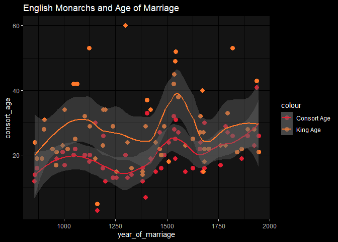

monarchs and marriages
================
fth

# notes:

get the list of English monarchs and their marriage ages.

# data location:

https://www.ianvisits.co.uk/articles/a-list-of-monarchs-by-marriage-6857/

``` r
library(dplyr)
```

    Warning: package 'dplyr' was built under R version 4.2.1


    Attaching package: 'dplyr'

    The following objects are masked from 'package:stats':

        filter, lag

    The following objects are masked from 'package:base':

        intersect, setdiff, setequal, union

``` r
library(stringr)
library(rvest)
```

    Warning: package 'rvest' was built under R version 4.2.1

``` r
library(ggplot2)
```

    Warning: package 'ggplot2' was built under R version 4.2.1

# get dataset

``` r
# url to scrape:
root <- "https://www.ianvisits.co.uk/articles/a-list-of-monarchs-by-marriage-6857/"
 
# get table
tables <- read_html(root) %>% html_nodes("table")
df <- tables[1] %>% html_table() %>% as.data.frame()

df <- df[, -6]      # remove spoiler 
df <- df[-c(1,2), ] # remove double-header effect

cols <- c("king_name", "king_age", "consort_name", "consort_age", "year_of_marriage")
colnames(df) <- cols
```

# quick eda

``` r
df %>% 
  mutate(
    king_age = as.numeric(king_age),
    consort_age = as.numeric(consort_age),
    year_of_marriage = as.numeric(year_of_marriage)
  ) %>% 
  ggplot(.) + 
  geom_point(aes(x = year_of_marriage, y = consort_age, color = "Consort Age"), size = 3) + 
  geom_point(aes(x = year_of_marriage, y = king_age, color = "King Age"), size = 3) + 
   geom_smooth(aes(x = year_of_marriage, y = consort_age, color = "Consort Age"), span = .4) + 
   geom_smooth(aes(x = year_of_marriage, y = king_age, color = "King Age"), span = .4) + 
  ggdark::dark_mode() + 
  labs(
    title = "English Monarchs and Age of Marriage"
      ) + 
  PrettyCols::scale_color_pretty_d("Rainbow")
```

    Warning in mask$eval_all_mutate(quo): NAs introduced by coercion

    Warning in mask$eval_all_mutate(quo): NAs introduced by coercion

    Warning in mask$eval_all_mutate(quo): NAs introduced by coercion

    Inverted geom defaults of fill and color/colour.
    To change them back, use invert_geom_defaults().

    `geom_smooth()` using method = 'loess' and formula 'y ~ x'

    Warning: Removed 26 rows containing non-finite values (stat_smooth).

    `geom_smooth()` using method = 'loess' and formula 'y ~ x'

    Warning: Removed 20 rows containing non-finite values (stat_smooth).

    Warning: Removed 26 rows containing missing values (geom_point).

    Warning: Removed 20 rows containing missing values (geom_point).


